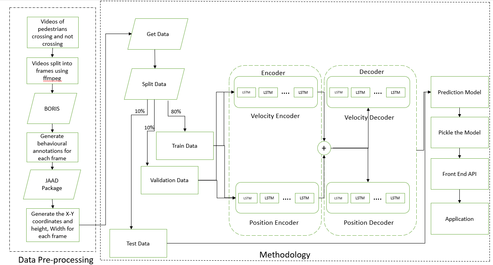

\

**Pedestrian intention Prediction: A Smart way to analyze Pedestrian Perspective**

Predicting pedestrian trajectories is one of the main problems with computer vision in the auto industry, especially in the field of advanced driver assistance systems. The ability to foresee people's upcoming movements is a key issue that now offers technical hurdles in numerous sectors, such as self-driving automobiles or sophisticated surveillance systems. In this project we develop an application which helps in to predict the pedestrian intentions while crossing or not crossing the road for the safety of both pedestrian and autonomous car driver. It refers to the back-end machine learning model's predictions which is based on the LSTM neural network to prompt the autonomous vehicle to take appropriate decision based on the predicted pedestrian behavior. By anticipating walkers' intentions and visual conditions, Pedestrian Intention Prediction provides a solution to the issue. We can determine a person's purpose using the predictions we've made, and we can then make decisions about when to halt and when to pass depending on that information. Despite the fact that our method produces superior results to earlier studies, longer-term prediction still needs to be improved. In this study, we showed how employing multi-task learning architecture, forecasting the velocity of bounding boxes rather than their placements, and using their observed speeds and positions might all help to increase the predictability of pedestrian intention.

\

### INTRODUCTION
As the industry of automotive vehicles growing rapidly, the ability of those vehicles to predict trajectories of pedestrians becomes more crucial than ever. Predicting pedestrian trajectories is a challenging problem since people might abruptly change their course in response to objects, moving cars, human contact, etc. Each pedestrian has a distinctive stride, acceleration, and velocity pattern that defines them as individuals. An autonomous vehicle in such a situation should be able to anticipate the positions of pedestrians and adjust its path accordingly to avoid collision. The problem can be viewed as a sequence problem, in this project we anticipate the future positions of the pedestrians based on their past positions which is known as bounding box. In this project, we compare the performance of different machine learning models. An arbitrary number of people previous positions in x-y coordinates and the output is the next future positions of the pedestrian. The methods been applied are Long Short-Term Memory (LSTM) combined with linear regression. 

\

### DATA COLLECTION
JAAD (Joint Attention in autonomous driving)- https://data.nvision2.eecs.yorku.ca/JAAD_dataset/ 

The dataset is JAAD (joint attention autonomous driving) which mainly focuses on the pedestrian and autonomous car driver behavior while crossing the road. It considers the various factors which influence pedestrian intentions. This dataset includes 346 videos of 5 -12 seconds long are recorded which shows various driving scenarios in urban areas. The videos are broken into frames. The total number of frames 81,954 after splitting the videos. Our training set consists of the first 300 videos, while our testing set consists of the last 46. This makes sure that there is no overlap between the testing and training situations. When the data is preprocessed and available for analysis, we used different models to determine the pedestrian actual behavior. 
We also collected our own data which includes videos shot from the first-person perspective that depict people walking through various public spaces. The collected data is used as test dataset apart from the existing JAAD dataset.

\

### BACKGROUND 
The majority of earlier studies on pedestrian prediction took a bird's-eye perspective of pedestrians into account, where as our project uses pedestrian as viewed through a car's camera. The majority of earlier work neglects to include the pedestrian's breadth, height, and direction, all of which are important and might help forecast pedestrians' intentions more accurately.

\

### METHODOLOGY

\

### RESULTS

\

### CONCLUSION
We have provided a technique for predicting bounding box states and pedestrian intentions using a machine learning approach. The developed model is capable of anticipating pedestrian status (bounding box) and pedestrian intention, both of which are competitively performing tasks. With the use of observed bounding box locations and speeds, we showed that it is possible to anticipate the bounding boxes' velocities rather than their positions. 

Despite being better at forecasting outcomes for the JAAD dataset, the model is unable to do so for any other dataset. Most of the predictions provided by the model are inaccurate and it performs poorly for any dataset that is not trained on the JAAD dataset. In the future, we will investigate potential reasons for the model's failure using newly obtained data, train the model using the data, and make predictions. Development a front-end application which takes in a video are the input and outputs a video with pedestrian prediction can be achieve.